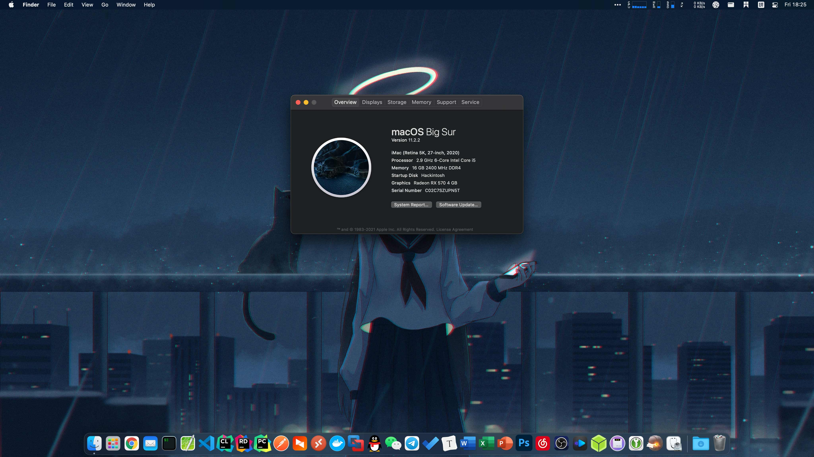

My Hackintosh

- OS: macOS Big Sur 11.1 (20C69)
- OpenCore Version: [0.6.5](https://github.com/acidanthera/OpenCorePkg/releases/tag/0.6.5)
- CPU: Intel® Core™ i5-10400 Processor
- RAM: Kingston HyperX FURY DDR4 2400 16GB
- iGPU: Intel® UHD Graphics 630
- dGPU: Sapphire NITRO+ RX 570 4GB
- Audio: Realtek ALCS1200A
- WLAN & Blutooth: Broadcom BCM943602CS (PCI-E x1 Adapter Card & 9Pin USB Header)
- SSD: LITEON T11 M.2 NVMe 256GB
- Motherboard: ASRock B460M Pro4 (BIOS: [L1.51](https://www.asrock.com/mb/Intel/B460M%20Pro4/index.asp#BIOS))

What's Working

- AirDrop
- Handoff & Universal Clipboard
- Onboard Audio ALCS1200A
- iGPU & dGPU Hardware Acceleration
- USB 3.0 (Solution: Change A2AF to A3AF in USBInjectAll.kext and XHCI-unsupported.kext)
- Sleep / Wake (Solution:  Use 19Pin to 9Pin adapter cable to connect to Bluetooth 9Pin USB header)

Kexts Used

- Lilu.kext: [1.5.0](https://github.com/acidanthera/Lilu/releases/tag/1.5.0)
- VirtualSMC.kext: [1.1.9](https://github.com/acidanthera/VirtualSMC/releases/tag/1.1.9)
- WhateverGreen.kext: [1.4.6](https://github.com/acidanthera/WhateverGreen/releases/tag/1.4.6)
- AppleALC.kext: [1.5.6](https://github.com/acidanthera/AppleALC/releases/tag/1.5.6)
- IntelMausi.kext: [1.0.5](https://github.com/acidanthera/IntelMausi/releases/tag/1.0.5)
- USBInjectAll.kext: [2018-1108](https://bitbucket.org/RehabMan/os-x-usb-inject-all/downloads/)
- XHCI-unsupported.kext: [ad591b3](https://github.com/RehabMan/OS-X-USB-Inject-All/tree/ad591b348fb6f0d407c2de846585b9f92876d6d8/XHCI-unsupported.kext)

Utils Used

- [gibMacOS](https://github.com/corpnewt/gibMacOS)
- [Hackintool](https://github.com/headkaze/Hackintool)
- [ProperTree](https://github.com/corpnewt/ProperTree)
- [OpenCore Configurator](https://mackie100projects.altervista.org/download-opencore-configurator/)

BIOS Settings

- Boot Screen - Fast Boot - Disabled (Default)
- Boot Screen - CSM (Compatibility Support Module) - CSM - Disabled (Default)
- Security Screen - Secure Boot - Disabled (Default)
- Security Screen - Intel(R) Platform Trust Technology - Disabled (Default)
- Advanced Screen - CPU Configuration - CFG Lock - Disabled (Default)
- Advanced Screen - CPU Configuration - Software Guard Extensions (SGX) - Disabled (Default)
- Advanced Screen - CPU Configuration - Intel Virtualization Technology - Enabled (Default)
- Advanced Screen - CPU Configuration - Intel Hyper Threading Technology - Enabled (Default)
- Advanced Screen - Chipset Configuration - Above 4G Decoding - **Enabled**
- Advanced Screen - Chipset Configuration - Share Memory - **64MB**
- Advanced Screen - USB Configuration - XHCI Hand-off - **Enabled**
- Advanced Screen - Storage Configuration - SATA Mode Selection - AHCI (Default)

Read More

- [Dortania's OpenCore Install Guide](https://dortania.github.io/OpenCore-Install-Guide/)

| Screenshot |
| :----------: |
|  |
